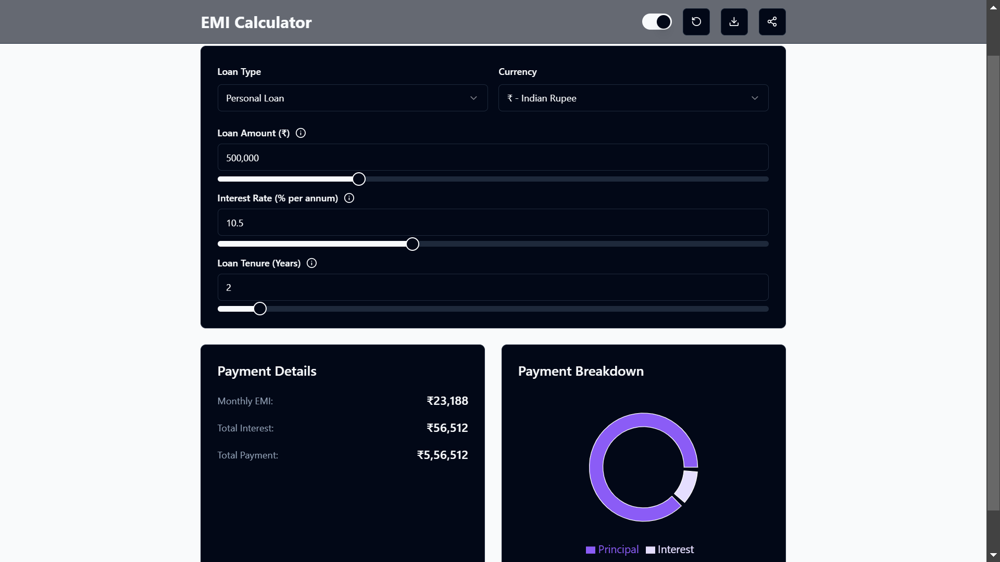

# 💰 EMI Calculator App

A modern, user-friendly EMI (Equated Monthly Installment) calculator built with React and TypeScript to help users calculate their loan payments easily.

## ✨ Features

- Calculate EMI based on principal amount, interest rate, and loan tenure
- Real-time calculation updates
- Interactive input controls
- Responsive design that works across all devices
- Clean and intuitive user interface
- Detailed breakdown of total payment, total interest, and monthly installments

## 🌐 Live Preview

<div align="center">
  
### 🚀 [Experience the App](https://emi-calculator-app-fawn.vercel.app/) 
#### Calculate Your EMI in Seconds! ⚡️
  
</div>

 <!-- Add your app screenshot here -->

## 🛠️ Technologies Used

- Vite
- React 18
- TypeScript
- Tailwind CSS <!-- Update based on your styling solution -->
- React Hooks
- Modern JavaScript (ES6+)

## 📦 Installation

1. Clone the repository:
```bash
git clone https://github.com/yourusername/emi-calculator-app.git
```

2. Navigate to the project directory:
```bash
cd emi-calculator-app
```

3. Install dependencies:
```bash
npm install
```

4. Start the development server:
```bash
npm start
```

The app will open in your default browser at `http://localhost:3000`

## 💻 Usage

1. Enter the loan amount in your preferred currency
2. Input the interest rate (annual)
3. Select the loan tenure in years or months
4. The EMI amount will be calculated automatically
5. View the detailed breakdown of your loan payments

## 🧮 EMI Calculation Formula

The EMI is calculated using the following formula:

```
EMI = P × r × (1 + r)^n/((1 + r)^n - 1)

Where:
P = Principal loan amount
r = Monthly interest rate (Annual rate ÷ 12 ÷ 100)
n = Total number of months
```

## 📱 Responsive Design

The app is designed to work seamlessly across:
- Desktop computers
- Tablets
- Mobile devices

## 🤝 Contributing

Contributions are welcome! Please feel free to submit a Pull Request.

1. Fork the project
2. Create your feature branch (`git checkout -b feature/AmazingFeature`)
3. Commit your changes (`git commit -m 'Add some AmazingFeature'`)
4. Push to the branch (`git push origin feature/AmazingFeature`)
5. Open a Pull Request

## 📝 License

This project is licensed under the MIT License - see the [LICENSE.md](LICENSE.md) file for details.

## 👨‍💻 Author

Your Name
- GitHub: [@deepakpatil26](https://github.com/deepakpatil26)

## 🙏 Acknowledgments

- Hat tip to anyone whose code was used
- Inspiration
- References

## 📞 Support

For support, email deepakpatil2612@gmail.com or create an issue in this repository.